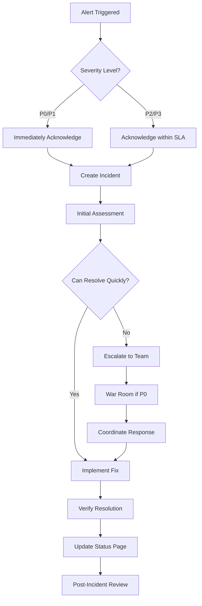

# Scorpius Enterprise Platform - Operational Runbook

## 🎯 Overview

This operational runbook provides comprehensive procedures for day-to-day operations, monitoring, troubleshooting, and maintenance of the Scorpius Enterprise Platform. It serves as the definitive guide for platform operators, DevOps engineers, and on-call personnel to ensure 99.9% uptime and enterprise-grade reliability.

**Target Audience**: Platform Engineers, DevOps Teams, Site Reliability Engineers, On-Call Personnel

---

## 🏗️ Platform Health Monitoring

### **Health Check Endpoints**

#### **Service Health Status**

| Service | Health Endpoint | Expected Response | Critical |
|---------|----------------|-------------------|----------|
| **Wallet Guard** | `GET http://wallet-guard:8000/health` | `{"status": "healthy"}` | ✅ YES |
| **Auth Proxy** | `GET http://auth-proxy:8001/health` | `{"status": "healthy"}` | ✅ YES |
| **Usage Metering** | `GET http://usage-meter:8002/health` | `{"status": "healthy"}` | ✅ YES |
| **Audit Trail** | `GET http://audit-trail:8003/health` | `{"status": "healthy"}` | ✅ YES |
| **Reporting** | `GET http://reporting:8007/health` | `{"status": "healthy"}` | ❌ NO |
| **Web Dashboard** | `GET http://dashboard:3000/health` | `{"status": "healthy"}` | ❌ NO |

#### **Infrastructure Health Checks**

```bash
# Database connectivity check
kubectl exec -it postgresql-0 -- pg_isready -h localhost -p 5432

# Redis connectivity check  
kubectl exec -it redis-0 -- redis-cli ping

# QLDB connectivity check
aws qldb describe-ledger --name scorpius-audit-trail --region us-west-2

# Load balancer health
kubectl get ingress -n scorpius-platform
```

### **Monitoring Dashboard Access**

#### **Grafana Dashboards**
- **Platform Overview**: `https://grafana.scorpius.com/d/platform-overview`
- **Service Metrics**: `https://grafana.scorpius.com/d/service-metrics`
- **Infrastructure Health**: `https://grafana.scorpius.com/d/infrastructure`
- **Security Monitoring**: `https://grafana.scorpius.com/d/security`

#### **Key Performance Indicators (KPIs)**

| Metric | Threshold | Critical Alert | Dashboard Panel |
|--------|-----------|----------------|-----------------|
| **API Response Time** | < 100ms | > 500ms | Service Metrics |
| **Error Rate** | < 0.1% | > 1% | Platform Overview |
| **CPU Utilization** | < 70% | > 90% | Infrastructure |
| **Memory Usage** | < 80% | > 95% | Infrastructure |
| **Database Connections** | < 80% | > 95% | Database |
| **Queue Depth** | < 1000 | > 5000 | Background Jobs |

---

## 🚨 Alert Response Procedures

### **Severity Levels**

#### **CRITICAL (P0) - 15 Minutes Response**
- Platform completely unavailable
- Data corruption or loss
- Security breach detected
- All critical services down

#### **HIGH (P1) - 1 Hour Response**  
- Major feature unavailable
- Performance severely degraded
- Single critical service down
- High error rates

#### **MEDIUM (P2) - 4 Hours Response**
- Minor feature issues
- Performance slightly degraded
- Non-critical service down
- Monitoring issues

#### **LOW (P3) - Next Business Day**
- Documentation issues
- Minor UI problems
- Enhancement requests
- Non-urgent maintenance

### **Alert Response Workflow**



### **On-Call Escalation**

#### **Primary On-Call**
1. **Platform Engineer** (15 min response)
2. **Senior DevOps Engineer** (30 min response)
3. **Engineering Manager** (1 hour response)
4. **VP Engineering** (2 hour response)

#### **Specialist Escalation**
- **Database Issues**: DBA Team → `dba-oncall@scorpius.com`
- **Security Issues**: Security Team → `security-incident@scorpius.com`  
- **Network Issues**: Network Team → `network-oncall@scorpius.com`
- **Cloud Issues**: Cloud Team → `cloud-oncall@scorpius.com`

---

## 🔧 Troubleshooting Procedures

### **Common Issues and Solutions**

#### **1. Service Unavailable (503 Errors)**

**Symptoms:**
- Health check endpoints returning 503
- Load balancer showing backend unavailable
- High error rates in monitoring

**Troubleshooting Steps:**
```bash
# 1. Check service status
kubectl get pods -n scorpius-platform

# 2. Check service logs
kubectl logs -f deployment/wallet-guard -n scorpius-platform --tail=100

# 3. Check resource usage
kubectl top pods -n scorpius-platform

# 4. Check horizontal pod autoscaler
kubectl get hpa -n scorpius-platform

# 5. Manual scaling if needed
kubectl scale deployment wallet-guard --replicas=5 -n scorpius-platform
```

**Resolution Priority:**
1. Scale up pods if resource constrained
2. Restart unhealthy pods
3. Check for configuration issues
4. Verify database connectivity
5. Escalate if issue persists > 15 minutes

#### **2. High API Response Times**

**Symptoms:**
- Response times > 500ms
- Grafana alerts for latency
- User reports of slow performance

**Troubleshooting Steps:**
```bash
# 1. Check database performance
kubectl exec -it postgresql-0 -- psql -U postgres -c "SELECT * FROM pg_stat_activity WHERE state = 'active';"

# 2. Check Redis cache hit ratio
kubectl exec -it redis-0 -- redis-cli info stats | grep keyspace_hits

# 3. Check for long-running queries
kubectl logs deployment/wallet-guard -n scorpius-platform | grep "SLOW QUERY"

# 4. Monitor connection pools
kubectl exec -it postgresql-0 -- psql -U postgres -c "SELECT count(*) FROM pg_stat_activity;"
```

**Resolution Actions:**
1. Clear Redis cache if needed
2. Scale up database read replicas
3. Enable query caching
4. Optimize slow queries
5. Scale up application pods

#### **3. Database Connection Issues**

**Symptoms:**
- Connection pool exhaustion
- Database timeout errors
- Services unable to connect to DB

**Troubleshooting Steps:**
```bash
# 1. Check database status
kubectl get pods -l app=postgresql -n scorpius-platform

# 2. Check connection count
kubectl exec -it postgresql-0 -- psql -U postgres -c "SELECT count(*) FROM pg_stat_activity;"

# 3. Check for locks
kubectl exec -it postgresql-0 -- psql -U postgres -c "SELECT * FROM pg_locks WHERE NOT granted;"

# 4. Review connection configuration
kubectl get configmap postgres-config -n scorpius-platform -o yaml
```

**Resolution Actions:**
1. Increase connection pool limits
2. Kill long-running connections
3. Restart database if necessary
4. Scale read replicas
5. Review connection pooling configuration

#### **4. Memory/CPU Resource Issues**

**Symptoms:**
- OOMKilled pods
- High CPU utilization alerts
- Performance degradation

**Troubleshooting Steps:**
```bash
# 1. Check resource usage
kubectl top pods -n scorpius-platform --sort-by=memory
kubectl top pods -n scorpius-platform --sort-by=cpu

# 2. Check resource limits
kubectl describe pod <pod-name> -n scorpius-platform

# 3. Check node resources
kubectl top nodes

# 4. Check HPA status
kubectl get hpa -n scorpius-platform
kubectl describe hpa wallet-guard-hpa -n scorpius-platform
```

**Resolution Actions:**
1. Scale horizontally if possible
2. Increase resource limits
3. Add more nodes to cluster
4. Optimize application memory usage
5. Review garbage collection settings

---

## 🔄 Maintenance Procedures

### **Scheduled Maintenance Windows**

#### **Maintenance Schedule**
- **Minor Updates**: Every Tuesday 2:00 AM - 4:00 AM PST
- **Major Updates**: First Sunday of each month 1:00 AM - 6:00 AM PST
- **Security Patches**: As needed, emergency maintenance
- **Database Maintenance**: Third Sunday of each month 12:00 AM - 4:00 AM PST

#### **Pre-Maintenance Checklist**
- [ ] Notify customers 48 hours in advance
- [ ] Update status page with maintenance window
- [ ] Backup all critical data
- [ ] Prepare rollback procedures
- [ ] Test changes in staging environment
- [ ] Coordinate with on-call team
- [ ] Prepare monitoring for post-deployment

### **Deployment Procedures**

#### **Blue-Green Deployment Process**

```bash
# 1. Deploy to green environment
kubectl apply -f k8s/green/ -n scorpius-platform-green

# 2. Health check green environment
./scripts/health-check.sh scorpius-platform-green

# 3. Run smoke tests
./scripts/smoke-tests.sh green

# 4. Switch traffic to green (gradual)
kubectl patch service wallet-guard -n scorpius-platform -p '{"spec":{"selector":{"version":"green"}}}'

# 5. Monitor for 15 minutes
./scripts/monitor-deployment.sh

# 6. Complete switch or rollback
if [ $? -eq 0 ]; then
    echo "Deployment successful"
    ./scripts/cleanup-blue.sh
else
    echo "Rolling back to blue"
    kubectl patch service wallet-guard -n scorpius-platform -p '{"spec":{"selector":{"version":"blue"}}}'
fi
```

#### **Database Migration Process**

```bash
# 1. Create database backup
pg_dump -h <db-host> -U postgres scorpius_prod > backup_$(date +%Y%m%d_%H%M).sql

# 2. Test migration on replica
./scripts/test-migration.sh backup_$(date +%Y%m%d_%H%M).sql

# 3. Put application in maintenance mode
kubectl scale deployment wallet-guard --replicas=0 -n scorpius-platform

# 4. Run migration
./scripts/run-migration.sh

# 5. Verify migration
./scripts/verify-migration.sh

# 6. Restore application
kubectl scale deployment wallet-guard --replicas=3 -n scorpius-platform

# 7. Verify functionality
./scripts/post-migration-tests.sh
```

### **Backup and Recovery Procedures**

#### **Daily Backup Process**

```bash
#!/bin/bash
# Database backup
pg_dump -h postgresql -U postgres scorpius_prod | gzip > /backups/db/scorpius_$(date +%Y%m%d).sql.gz

# Configuration backup
kubectl get configmaps -n scorpius-platform -o yaml > /backups/config/configmaps_$(date +%Y%m%d).yaml
kubectl get secrets -n scorpius-platform -o yaml > /backups/config/secrets_$(date +%Y%m%d).yaml

# Upload to S3
aws s3 sync /backups/ s3://scorpius-backups/$(date +%Y/%m/%d)/

# Cleanup old backups (keep 30 days)
find /backups -name "*.sql.gz" -mtime +30 -delete
```

#### **Disaster Recovery Process**

**RTO (Recovery Time Objective): 4 hours**  
**RPO (Recovery Point Objective): 1 hour**

1. **Assess Damage (15 minutes)**
   - Determine scope of outage
   - Identify affected components
   - Activate disaster recovery team

2. **Initiate Recovery (30 minutes)**
   - Switch to DR region if needed
   - Restore from latest backup
   - Verify backup integrity

3. **Restore Services (2 hours)**
   - Deploy platform in DR environment
   - Restore database from backup
   - Verify service functionality

4. **Verify and Resume (1 hour)**
   - Run comprehensive tests
   - Update DNS records
   - Monitor for issues

5. **Post-Recovery (30 minutes)**
   - Update status page
   - Notify stakeholders
   - Begin post-mortem process

---

## 📊 Performance Optimization

### **Performance Monitoring**

#### **Key Metrics to Monitor**

```bash
# API Performance
curl -w "@curl-format.txt" -o /dev/null -s "http://api.scorpius.com/health"

# Database Performance
kubectl exec -it postgresql-0 -- psql -U postgres -c "
SELECT query, mean_exec_time, calls 
FROM pg_stat_statements 
ORDER BY mean_exec_time DESC 
LIMIT 10;"

# Cache Performance  
kubectl exec -it redis-0 -- redis-cli info stats | grep -E "(keyspace_hits|keyspace_misses)"

# Queue Performance
kubectl exec -it redis-0 -- redis-cli llen background_jobs
```

#### **Performance Tuning Actions**

1. **Database Optimization**
   ```bash
   # Analyze query performance
   kubectl exec -it postgresql-0 -- psql -U postgres -c "ANALYZE;"
   
   # Update statistics
   kubectl exec -it postgresql-0 -- psql -U postgres -c "VACUUM ANALYZE;"
   
   # Check index usage
   kubectl exec -it postgresql-0 -- psql -U postgres -c "
   SELECT schemaname, tablename, attname, n_distinct, correlation 
   FROM pg_stats 
   WHERE schemaname = 'public';"
   ```

2. **Cache Optimization**
   ```bash
   # Check cache hit ratio
   kubectl exec -it redis-0 -- redis-cli info stats
   
   # Clear cache if needed
   kubectl exec -it redis-0 -- redis-cli flushdb
   
   # Optimize cache settings
   kubectl exec -it redis-0 -- redis-cli config set maxmemory-policy allkeys-lru
   ```

3. **Application Scaling**
   ```bash
   # Horizontal scaling
   kubectl scale deployment wallet-guard --replicas=10 -n scorpius-platform
   
   # Vertical scaling
   kubectl patch deployment wallet-guard -n scorpius-platform -p '
   {
     "spec": {
       "template": {
         "spec": {
           "containers": [{
             "name": "wallet-guard",
             "resources": {
               "limits": {"cpu": "2", "memory": "4Gi"},
               "requests": {"cpu": "1", "memory": "2Gi"}
             }
           }]
         }
       }
     }
   }'
   ```

---

## 🔐 Security Operations

### **Security Monitoring**

#### **Real-time Security Checks**

```bash
# Check for suspicious API activity
kubectl logs deployment/wallet-guard -n scorpius-platform | grep -E "(401|403|429)" | tail -50

# Monitor failed authentication attempts  
kubectl logs deployment/auth-proxy -n scorpius-platform | grep "authentication failed" | tail -20

# Check for potential DDoS
kubectl logs deployment/api-gateway -n scorpius-platform | grep "rate_limit_exceeded" | wc -l

# Monitor privilege escalation attempts
kubectl logs deployment/wallet-guard -n scorpius-platform | grep "privilege_escalation" | tail -10
```

#### **Security Incident Response**

1. **Immediate Actions (< 5 minutes)**
   ```bash
   # Block suspicious IP
   kubectl patch networkpolicy default-deny -n scorpius-platform --patch '
   {
     "spec": {
       "ingress": [{
         "from": [{"namespaceSelector": {}}],
         "except": [{"ipBlock": {"cidr": "SUSPICIOUS_IP/32"}}]
       }]
     }
   }'
   
   # Suspend compromised API key
   kubectl patch secret api-keys -n scorpius-platform --patch '
   {
     "data": {
       "COMPROMISED_KEY": null
     }
   }'
   ```

2. **Investigation Actions (< 30 minutes)**
   ```bash
   # Collect evidence
   kubectl logs deployment/wallet-guard -n scorpius-platform --since=1h > incident_logs.txt
   
   # Check audit trail
   aws qldb execute-statement --ledger-name scorpius-audit-trail --statement "
   SELECT * FROM audit_events 
   WHERE timestamp > '$(date -u -d '1 hour ago' +%Y-%m-%dT%H:%M:%S.000Z)'
   ORDER BY timestamp DESC"
   ```

3. **Containment Actions (< 1 hour)**
   ```bash
   # Isolate affected services
   kubectl scale deployment affected-service --replicas=0 -n scorpius-platform
   
   # Enable additional monitoring
   kubectl apply -f security/enhanced-monitoring.yaml -n scorpius-platform
   ```

### **Compliance Procedures**

#### **Audit Trail Verification**

```bash
# Verify QLDB integrity
aws qldb get-digest --ledger-name scorpius-audit-trail --region us-west-2

# Export audit records for compliance
aws qldb export-journal-to-s3 \
    --ledger-name scorpius-audit-trail \
    --inclusive-start-time $(date -u -d '30 days ago' +%Y-%m-%dT%H:%M:%S.000Z) \
    --inclusive-end-time $(date -u +%Y-%m-%dT%H:%M:%S.000Z) \
    --role-arn arn:aws:iam::ACCOUNT:role/QLDBExportRole \
    --s3-export-configuration Bucket=scorpius-audit-exports,Prefix=monthly/

# Generate compliance report
./scripts/generate-compliance-report.sh --period monthly --type sox
```

---

## 📞 Emergency Contacts

### **Incident Response Team**

| Role | Primary Contact | Phone | Email | Backup |
|------|----------------|-------|-------|---------|
| **Incident Commander** | John Smith | +1-555-0001 | john.smith@scorpius.com | Jane Doe |
| **Technical Lead** | Mike Johnson | +1-555-0002 | mike.johnson@scorpius.com | Sarah Wilson |
| **Security Lead** | Emily Davis | +1-555-0003 | emily.davis@scorpius.com | Robert Brown |
| **Communications** | Lisa Chen | +1-555-0004 | lisa.chen@scorpius.com | David Garcia |

### **Vendor Support**

| Service | Support Contact | Phone | Priority Level |
|---------|----------------|-------|----------------|
| **AWS Support** | Enterprise Support | +1-800-AWS-HELP | Business Critical |
| **Database Support** | PostgreSQL Pro | +1-855-POSTGRES | High |
| **Monitoring Support** | Grafana Enterprise | +1-888-GRAFANA | Medium |
| **Security Support** | CrowdStrike | +1-855-CROWDSTRIKE | High |

### **24/7 Hotlines**

- **Platform Emergency**: +1-800-SCORPIUS-OPS
- **Security Incident**: +1-800-SCORPIUS-SEC  
- **Customer Support**: +1-800-SCORPIUS-HELP

---

## 📋 Maintenance Checklists

### **Daily Operations Checklist**

- [ ] Review overnight alerts and resolve any issues
- [ ] Check service health dashboards for anomalies
- [ ] Verify backup completion and integrity
- [ ] Monitor resource utilization trends
- [ ] Review security monitoring alerts
- [ ] Update incident tracking and documentation
- [ ] Check capacity planning metrics

### **Weekly Operations Checklist**

- [ ] Review performance trends and optimization opportunities
- [ ] Update and test disaster recovery procedures
- [ ] Review and rotate API keys/certificates expiring soon
- [ ] Analyze security logs for suspicious patterns
- [ ] Update documentation based on recent changes
- [ ] Review monitoring alert thresholds and effectiveness
- [ ] Conduct post-incident reviews for the week

### **Monthly Operations Checklist**

- [ ] Perform security assessment and vulnerability scan
- [ ] Review and update capacity planning forecasts
- [ ] Test backup and recovery procedures
- [ ] Review and update runbook procedures
- [ ] Conduct service level agreement (SLA) review
- [ ] Update emergency contact information
- [ ] Review vendor support contracts and renewals

---

## 📚 Documentation and References

### **Internal Documentation**
- **Architecture Guide**: `ARCHITECTURE.md`
- **Security Documentation**: `SECURITY.md`
- **API Documentation**: `API.md`
- **Deployment Guide**: `DEPLOY_PRIVATE.md`
- **Threat Model**: `THREAT_MODEL.md`

### **External References**
- **Kubernetes Documentation**: https://kubernetes.io/docs/
- **PostgreSQL Documentation**: https://www.postgresql.org/docs/
- **Redis Documentation**: https://redis.io/documentation
- **AWS QLDB Documentation**: https://docs.aws.amazon.com/qldb/
- **Prometheus Documentation**: https://prometheus.io/docs/

### **Training Resources**
- **Platform Training**: `/docs/training/platform-basics.md`
- **Incident Response Training**: `/docs/training/incident-response.md`
- **Security Procedures**: `/docs/training/security-procedures.md`

---

*This runbook is maintained by the Scorpius Platform Operations team and updated monthly. For operational questions or to suggest improvements, contact [ops@scorpius.com](mailto:ops@scorpius.com).*

**Document Version**: 2.0  
**Last Updated**: December 2024  
**Next Review**: January 2025  
**Classification**: INTERNAL - Operations Team Only
