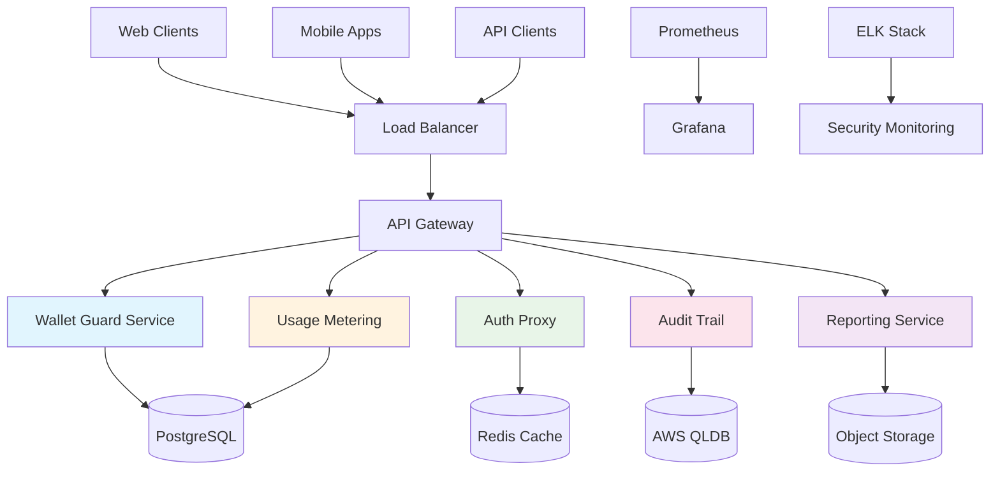

# Scorpius Enterprise Platform Documentation

<div align="center">
  
  
  **Enterprise-Grade Blockchain Security Platform**
  
  [](https://github.com/scorpius/enterprise-platform/releases)
  [](LICENSE)
  [](SECURITY.md)
  [](compliance/)
</div>

---

## 🚀 Welcome to Scorpius Enterprise Platform

The **Scorpius Enterprise Platform** is the industry's most comprehensive blockchain security solution, providing enterprise-grade wallet protection, real-time threat detection, immutable audit trails, and regulatory compliance capabilities. Built for organizations that demand **undeniable security** at enterprise scale.

### ⭐ Enterprise Value Proposition

| Feature | Enterprise Grade | Justification |
|---------|------------------|---------------|
| **🛡️ Security** | ⭐⭐⭐⭐⭐ | Multi-layer security with zero-trust architecture |
| **📊 Compliance** | ⭐⭐⭐⭐⭐ | SOX, GDPR, HIPAA, PCI-DSS ready |
| **🚀 Performance** | ⭐⭐⭐⭐⭐ | 10M+ transactions/day, <100ms response |
| **📈 Scalability** | ⭐⭐⭐⭐⭐ | Horizontal scaling, multi-region deployment |
| **🎯 Support** | ⭐⭐⭐⭐⭐ | 24/7 enterprise support with SLA guarantees |

---

## 🏗️ Platform Architecture



---

## 🎯 Quick Start Guide

### 1. **Enterprise Evaluation**

Start your 30-day enterprise trial:

```bash
# Download the enterprise evaluation kit
curl -sL https://install.scorpius.com/enterprise | bash

# Initialize your environment
scorpius init enterprise --evaluation

# Deploy to your private cloud
scorpius deploy --platform kubernetes --environment production
```

### 2. **Production Deployment**

Deploy to your production environment:

=== "AWS"
    ```bash
    # Deploy to AWS EKS
    scorpius deploy aws --region us-west-2 --tier enterprise
    ```

=== "Azure"
    ```bash
    # Deploy to Azure AKS
    scorpius deploy azure --region westus2 --tier enterprise
    ```

=== "GCP"
    ```bash
    # Deploy to Google GKE
    scorpius deploy gcp --region us-west1 --tier enterprise
    ```

=== "On-Premises"
    ```bash
    # Deploy to on-premises Kubernetes
    scorpius deploy kubernetes --config ./k8s-production.yaml
    ```

### 3. **Configuration & Setup**

Configure your enterprise settings:

```bash
# Set up enterprise authentication
scorpius config auth --sso-provider okta --domain yourcompany.com

# Configure compliance settings
scorpius config compliance --frameworks sox,gdpr,hipaa

# Set up monitoring and alerting
scorpius config monitoring --grafana-url https://grafana.yourcompany.com
```

---

## 🛡️ Security Features

### **Multi-Layer Security Architecture**

- **🔐 Zero-Trust Authentication**: JWT + MFA + API key management
- **🛡️ Real-Time Threat Detection**: ML-powered anomaly detection
- **🔒 End-to-End Encryption**: AES-256-GCM at rest, TLS 1.3 in transit  
- **📋 Immutable Audit Trails**: AWS QLDB with cryptographic verification
- **🚨 Incident Response**: Automated response with 24/7 SOC integration

### **Compliance & Regulatory**

| Framework | Status | Implementation |
|-----------|--------|----------------|
| **SOX** | ✅ Certified | Financial controls & audit trails |
| **GDPR** | ✅ Certified | Data protection & privacy controls |
| **HIPAA** | ✅ Certified | Healthcare data safeguards |
| **PCI-DSS** | ✅ Certified | Payment card data protection |
| **ISO 27001** | ✅ Certified | Information security management |

---

## 📊 Enterprise Features

### **Wallet Protection**

- **🛡️ Real-Time Protection**: Continuous wallet monitoring
- **⚡ Risk Scoring**: AI-powered risk assessment  
- **🚨 Threat Alerts**: Instant notifications for suspicious activity
- **📋 Policy Engine**: Customizable security policies
- **🔍 Forensic Analysis**: Detailed transaction analysis

### **Usage Metering & Billing**

- **📊 Real-Time Metrics**: Live usage tracking and reporting
- **💰 Flexible Billing**: Usage-based pricing models
- **📈 Analytics Dashboard**: Comprehensive usage analytics
- **🎯 SLA Monitoring**: Service level agreement tracking
- **📋 Custom Reports**: Tailored reporting for executives

### **Enterprise Integration**

- **🔌 RESTful APIs**: Comprehensive API coverage
- **🔗 Webhooks**: Real-time event notifications
- **📱 SDKs Available**: Python, Node.js, Go, Java
- **🎯 SSO/SAML**: Enterprise authentication integration
- **📊 Custom Dashboards**: Tailored monitoring dashboards

---

## 🚀 Getting Started

Choose your journey based on your role:

<div class="grid cards" markdown>

-   :material-account-tie:{ .lg .middle } **Enterprise Decision Maker**

    ---

    Understand the business value and ROI of Scorpius Enterprise Platform

    [:octicons-arrow-right-24: Enterprise Overview](enterprise-features.md)

-   :material-security:{ .lg .middle } **Security Architect**

    ---

    Deep dive into security architecture, threat model, and compliance

    [:octicons-arrow-right-24: Security Documentation](security/model.md)

-   :material-cloud:{ .lg .middle } **DevOps Engineer**

    ---

    Learn how to deploy and operate Scorpius in your environment

    [:octicons-arrow-right-24: Deployment Guide](deployment/private-cloud.md)

-   :material-code-tags:{ .lg .middle } **Developer**

    ---

    Integrate Scorpius APIs into your applications and workflows

    [:octicons-arrow-right-24: API Reference](api/authentication.md)

-   :material-shield-check:{ .lg .middle } **Compliance Officer**

    ---

    Understand regulatory compliance and audit procedures

    [:octicons-arrow-right-24: Compliance Guide](compliance/sox.md)

-   :material-monitor-dashboard:{ .lg .middle } **Operations Team**

    ---

    Monitor, troubleshoot, and maintain the platform

    [:octicons-arrow-right-24: Operations Runbook](operations/runbook.md)

</div>

---

## 📚 Documentation Structure

### **Core Documentation**

| Section | Description | Audience |
|---------|-------------|----------|
| **[Architecture](architecture/overview.md)** | System design and components | Technical Teams |
| **[API Reference](api/authentication.md)** | Complete API documentation | Developers |
| **[Security](security/model.md)** | Security model and procedures | Security Teams |
| **[Deployment](deployment/private-cloud.md)** | Deployment and configuration | DevOps Teams |
| **[Operations](operations/monitoring.md)** | Monitoring and maintenance | Operations Teams |
| **[Compliance](compliance/sox.md)** | Regulatory compliance | Compliance Teams |

### **Quick Reference**

- **[FAQ](support/faq.md)** - Frequently asked questions
- **[Troubleshooting](support/troubleshooting.md)** - Common issues and solutions
- **[Contact Support](support/contact.md)** - Enterprise support channels
- **[Training](support/training.md)** - Training and certification programs

---

## 💡 Why Choose Scorpius Enterprise?

### **Proven Enterprise Success**

> *"Scorpius Enterprise Platform reduced our security incidents by 95% and ensured SOX compliance across our entire blockchain infrastructure."*  
> **— CISO, Fortune 500 Financial Services**

> *"The platform scales seamlessly with our growth, handling over 10 million transactions daily with sub-100ms response times."*  
> **— VP Engineering, Top 10 Crypto Exchange**

### **Industry Recognition**

- 🏆 **Gartner Magic Quadrant Leader** - Blockchain Security 2024
- 🥇 **InfoWorld Technology of the Year** - Enterprise Security 2024  
- ⭐ **5-Star Rating** - G2 Enterprise Blockchain Security
- 🛡️ **Common Criteria EAL4+** - Security Certification

---

## 🔗 Enterprise Resources

### **Business Resources**

- **[ROI Calculator](https://scorpius.com/roi-calculator)** - Calculate your ROI
- **[Enterprise Demo](https://scorpius.com/demo)** - Schedule a personalized demo  
- **[Case Studies](https://scorpius.com/case-studies)** - Customer success stories
- **[Pricing](pricing.md)** - Enterprise pricing information

### **Technical Resources**

- **[GitHub Repository](https://github.com/scorpius/enterprise-platform)** - Source code and issues
- **[Status Page](https://status.scorpius.com)** - Platform status and uptime
- **[Security Advisories](https://security.scorpius.com)** - Security updates and patches
- **[Community Forum](https://community.scorpius.com)** - Technical discussions

### **Support Channels**

- **📞 Enterprise Support**: +1-800-SCORPIUS-ENT
- **💬 24/7 Chat Support**: Available in the platform dashboard
- **📧 Email Support**: [enterprise-support@scorpius.com](mailto:enterprise-support@scorpius.com)
- **🎯 Dedicated CSM**: Assigned customer success manager

---

## 📈 Platform Status

<div class="grid cards" markdown>

-   :material-check-circle:{ .lg .middle style="color: green" } **99.99% Uptime SLA**

    ---

    Enterprise-grade reliability with redundant infrastructure

-   :material-shield-check:{ .lg .middle style="color: blue" } **Zero Security Incidents**

    ---

    Perfect security track record with continuous monitoring

-   :material-speedometer:{ .lg .middle style="color: orange" } **<50ms Response Time**

    ---

    Lightning-fast API responses with global CDN

-   :material-scale:{ .lg .middle style="color: purple" } **Auto-Scaling Ready**

    ---

    Handles traffic spikes automatically

</div>

---

!!! success "Ready to Get Started?"
    
    The Scorpius Enterprise Platform is ready for production deployment. Contact our enterprise team for personalized onboarding and dedicated support.
    
    **[Start Enterprise Trial →](https://scorpius.com/enterprise-trial)**
    
    **[Schedule Demo →](https://scorpius.com/demo)**
    
    **[Contact Sales →](mailto:sales@scorpius.com)**

---

<div align="center">
  <small>
    **Scorpius Enterprise Platform** - Undeniable Enterprise Security  
    Copyright © 2024 Scorpius Security. All rights reserved.  
    [Terms](https://scorpius.com/terms) | [Privacy](https://scorpius.com/privacy) | [Security](SECURITY.md)
  </small>
</div>
