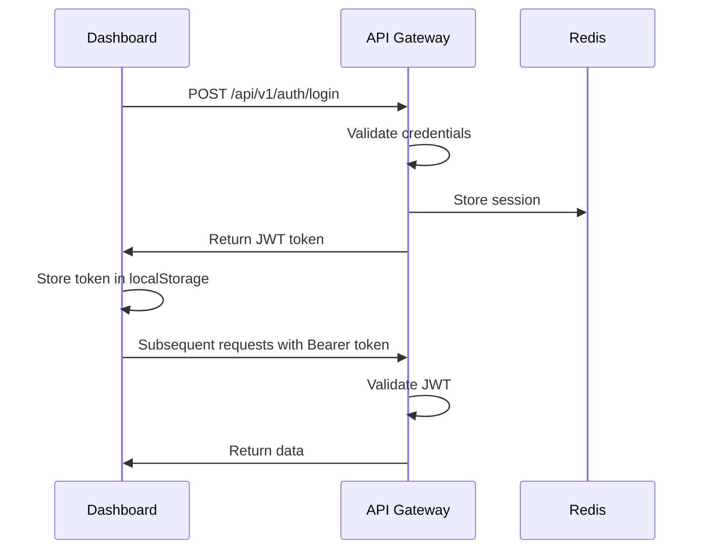
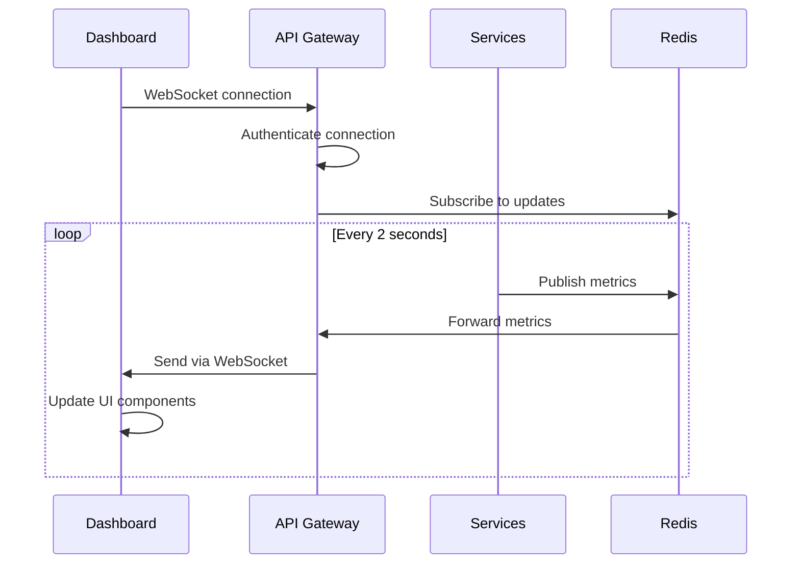

# 🎛️ Dashboard Integration Guide

This guide covers the complete integration between the Scorpius Fusion Dashboard and the enterprise backend platform.

## 🚀 Quick Start

### Prerequisites
- Docker and Docker Compose
- PowerShell 7+ (Windows) or Bash (Linux/macOS)
- Node.js 20+ (for local development)

### 1. Start the Integrated Platform

```powershell
# Windows
.\dashboard-start.ps1

# With options
.\dashboard-start.ps1 -Build -Clean -Logs
```

```bash
# Linux/macOS
./dashboard-start.sh
```

### 2. Access the Dashboard

- **Dashboard**: http://localhost:3000
- **API Gateway**: http://localhost:8000
- **API Docs**: http://localhost:8000/docs
- **WebSocket**: ws://localhost:8000/ws

### 3. Test Integration

```powershell
# Run integration tests
.\test-integration.ps1
```

## 🏗️ Architecture Overview

```
┌─────────────────────────────────────────────────────────────┐
│                    Scorpius Platform                        │
├─────────────────────────────────────────────────────────────┤
│  ┌─────────────────┐    ┌─────────────────┐                │
│  │  Fusion         │    │  API Gateway    │                │
│  │  Dashboard      │◄──►│  (FastAPI)      │                │
│  │  (React/Vite)   │    │  Port: 8000     │                │
│  │  Port: 3000     │    └─────────────────┘                │
│  └─────────────────┘              │                        │
│                                   ▼                        │
│  ┌─────────────────────────────────────────────────────────┤
│  │              Backend Services                           │
│  │  ┌─────────────┐ ┌─────────────┐ ┌─────────────┐       │
│  │  │   Bridge    │ │   Trading   │ │  Scanner    │       │
│  │  │   Service   │ │   Bot       │ │  Service    │       │
│  │  └─────────────┘ └─────────────┘ └─────────────┘       │
│  └─────────────────────────────────────────────────────────┤
│                              │                             │
│  ┌─────────────────────────────────────────────────────────┤
│  │              Infrastructure                             │
│  │  ┌─────────────┐ ┌─────────────┐ ┌─────────────┐       │
│  │  │ PostgreSQL  │ │    Redis    │ │ Monitoring  │       │
│  │  │ Database    │ │   Cache     │ │   Stack     │       │
│  │  └─────────────┘ └─────────────┘ └─────────────┘       │
│  └─────────────────────────────────────────────────────────┘
└─────────────────────────────────────────────────────────────┘
```

## 🔌 API Integration

### REST API Endpoints

The dashboard integrates with these API endpoints:

| Category | Endpoint | Description |
|----------|----------|-------------|
| **Auth** | `POST /api/v1/auth/login` | User authentication |
| **System** | `GET /api/v1/system/status` | System health status |
| **System** | `GET /api/v1/system/metrics` | Real-time metrics |
| **Trading** | `GET /api/v1/trading/stats` | Trading statistics |
| **Trading** | `GET /api/v1/trading/bots` | Bot status |
| **Bridge** | `GET /api/v1/bridge/status` | Bridge network status |
| **Analytics** | `GET /api/v1/analytics/kpi` | Key performance indicators |
| **Scanner** | `GET /api/v1/scanner/results` | Security scan results |
| **Computing** | `GET /api/v1/computing/cluster` | Cluster status |

### WebSocket Events

Real-time data is streamed via WebSocket:

| Event | Description | Update Frequency |
|-------|-------------|------------------|
| `system_metrics` | CPU, Memory, Disk usage | 2 seconds |
| `trading_stats` | Trading performance | 2 seconds |
| `trading_bots` | Bot positions and status | 2 seconds |
| `bridge_metrics` | Cross-chain transfer stats | 2 seconds |
| `cluster_metrics` | Computing cluster status | 2 seconds |

## 🐳 Docker Configuration

### Development Environment

```yaml
# docker/docker-compose.dev.yml
services:
  dashboard:
    build: 
      context: ../dashboard
      dockerfile: Dockerfile.dev
    ports:
      - "3000:3000"
      - "24678:24678"  # HMR
    environment:
      - VITE_API_BASE_URL=http://localhost:8000/api/v1
      - VITE_WS_BASE_URL=ws://localhost:8000/ws
    volumes:
      - ../dashboard:/app:rw
      - /app/node_modules
```

### Production Environment

```yaml
# docker-compose.prod.yml
services:
  dashboard:
    build: 
      context: ../dashboard
      dockerfile: Dockerfile.prod
    environment:
      - VITE_API_BASE_URL=${API_BASE_URL}
      - VITE_WS_BASE_URL=${WS_BASE_URL}
    labels:
      - "traefik.enable=true"
      - "traefik.http.routers.dashboard.rule=Host(`yourdomain.com`)"
```

## 🛠️ Development Workflow

### 1. Local Development

```bash
# Start backend services
docker-compose -f docker/docker-compose.dev.yml up redis postgres api-gateway

# Start dashboard separately for faster iteration
cd ../dashboard
npm install
npm run dev
```

### 2. Full Integration Testing

```bash
# Start everything together
.\dashboard-start.ps1

# Test the integration
.\test-integration.ps1
```

### 3. Hot Reload Setup

Both frontend and backend support hot reload:

- **Dashboard**: Vite HMR on port 24678
- **API Gateway**: File watching with auto-restart
- **Backend Services**: Volume mounts for code changes

## 🔐 Authentication Flow



## 📊 Real-time Data Flow



## 🧪 Testing

### Manual Testing Checklist

- [ ] Dashboard loads at http://localhost:3000
- [ ] Login/logout functionality
- [ ] Real-time data updates
- [ ] WebSocket connection stable
- [ ] All dashboard sections functional
- [ ] API responses within 1 second
- [ ] Error handling works
- [ ] Responsive design

### Automated Testing

```bash
# Run integration tests
.\test-integration.ps1

# Run frontend tests
cd ../dashboard
npm test

# Run backend tests
cd services/api-gateway
pytest
```

## 🚀 Deployment

### Production Deployment

```bash
# Build and deploy
docker-compose -f docker-compose.prod.yml up -d

# Scale services
docker-compose -f docker-compose.prod.yml up -d --scale api-gateway=3

# Update dashboard only
docker-compose -f docker-compose.prod.yml up -d --no-deps dashboard
```

### Environment Variables

```bash
# Production .env
VITE_API_BASE_URL=https://api.yourdomain.com/api/v1
VITE_WS_BASE_URL=wss://api.yourdomain.com/ws
JWT_SECRET=your-production-secret
CORS_ORIGINS=https://yourdomain.com,https://www.yourdomain.com
```

## 🔧 Troubleshooting

### Common Issues

1. **Dashboard not loading**
   ```bash
   # Check if service is running
   docker-compose -f docker-compose.dev.yml ps dashboard
   
   # Check logs
   docker-compose -f docker-compose.dev.yml logs dashboard
   ```

2. **API connection failed**
   ```bash
   # Test API manually
   curl http://localhost:8000/healthz
   
   # Check CORS settings
   curl -H "Origin: http://localhost:3000" http://localhost:8000/api/v1/system/status
   ```

3. **WebSocket connection issues**
   ```bash
   # Test WebSocket
   wscat -c ws://localhost:8000/ws
   
   # Check for proxy issues
   docker-compose -f docker-compose.dev.yml logs api-gateway | grep -i websocket
   ```

4. **Real-time data not updating**
   ```bash
   # Check Redis connection
   docker-compose -f docker-compose.dev.yml exec redis redis-cli ping
   
   # Monitor WebSocket messages
   # Open browser dev tools → Network → WS tab
   ```

### Performance Optimization

1. **Enable gzip compression** (automatically configured in Nginx)
2. **Use Redis caching** for API responses
3. **Optimize WebSocket message frequency**
4. **Implement connection pooling**

## 📈 Monitoring

### Health Checks

- **Dashboard**: `curl http://localhost:3000/health`
- **API Gateway**: `curl http://localhost:8000/healthz`
- **WebSocket**: Connection monitoring via dashboard

### Metrics

- Response times
- WebSocket connection count
- API request rates
- Error rates
- Resource usage

---

For additional help, see:
- [Backend Integration Guide](../dashboard/BACKEND_INTEGRATION.md)
- [API Documentation](http://localhost:8000/docs)
- [WebSocket API Reference](docs/websocket-api.md)
